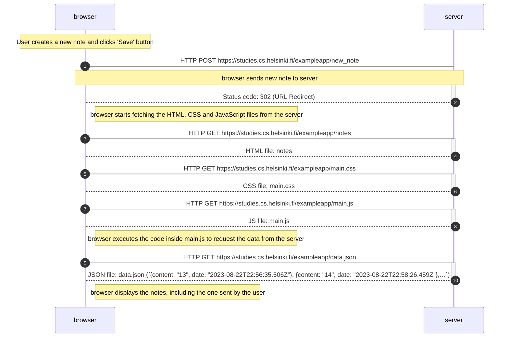

# New note process

```mermaid!
    sequenceDiagram
    autonumber
note over browser: User creates a new note and clicks 'Save' button

browser->server: HTTP POST https://studies.cs.helsinki.fi/exampleapp/new_note
note over browser,server: browser sends new note to server
activate server
server-->browser: Status code: 302 (URL Redirect)
deactivate server
note right of browser: browser starts fetching the HTML, CSS and JavaScript files from the server 
browser->server: HTTP GET https://studies.cs.helsinki.fi/exampleapp/notes
activate server
server-->browser: HTML file: notes
deactivate server
browser->server: HTTP GET https://studies.cs.helsinki.fi/exampleapp/main.css
activate server
server-->browser: CSS file: main.css
deactivate server
browser->server: HTTP GET https://studies.cs.helsinki.fi/exampleapp/main.js
activate server
server-->browser: JS file: main.js
deactivate server
note right of browser: browser executes the code inside main.js to request the data from the server 
browser->server: HTTP GET https://studies.cs.helsinki.fi/exampleapp/data.json
activate server
server-->browser: JSON file: data.json ([{content: "13", date: "2023-08-22T22:56:35.506Z"}, {content: "14", date: "2023-08-22T22:58:26.459Z"},…])
deactivate server
note right of browser: browser displays the notes, including the one sent by the user
```
