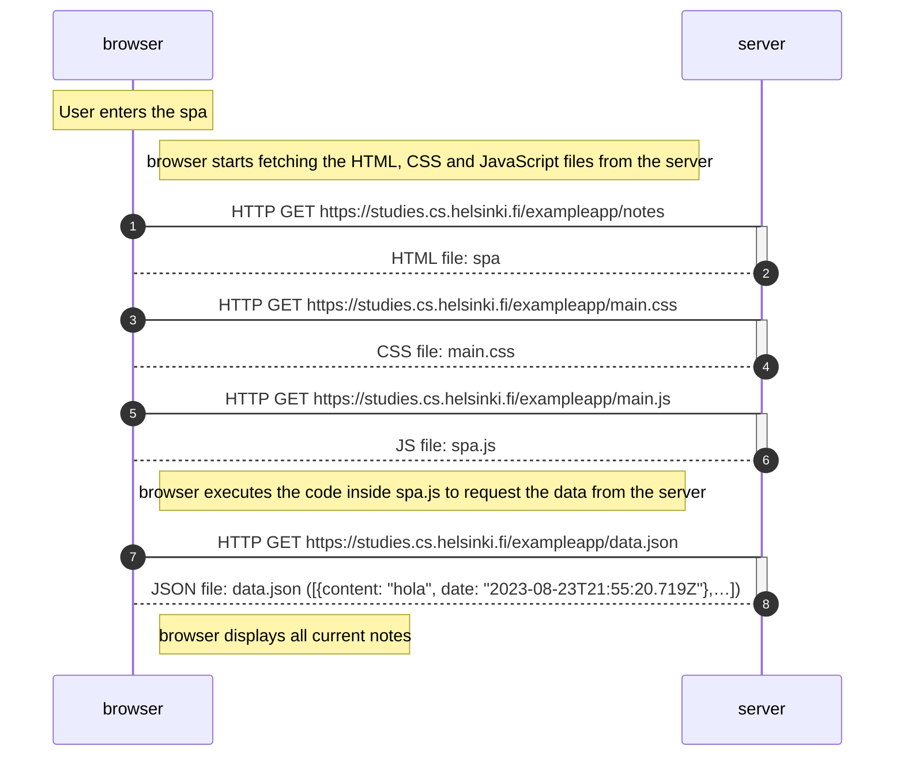

# SPA Diagram - User process

```mermaid
    sequenceDiagram
    autonumber
note over browser: User enters the spa

note right of browser: browser starts fetching the HTML, CSS and JavaScript files from the server 
browser->server: HTTP GET https://studies.cs.helsinki.fi/exampleapp/notes
activate server
server-->browser: HTML file: spa
deactivate server
browser->server: HTTP GET https://studies.cs.helsinki.fi/exampleapp/main.css
activate server
server-->browser: CSS file: main.css
deactivate server
browser->server: HTTP GET https://studies.cs.helsinki.fi/exampleapp/main.js
activate server
server-->browser: JS file: spa.js
deactivate server
note right of browser: browser executes the code inside spa.js to request the data from the server 
browser->server: HTTP GET https://studies.cs.helsinki.fi/exampleapp/data.json
activate server
server-->browser: JSON file: data.json ([{content: "hola", date: "2023-08-23T21:55:20.719Z"},…])
deactivate server
note right of browser: browser displays all current notes
```
