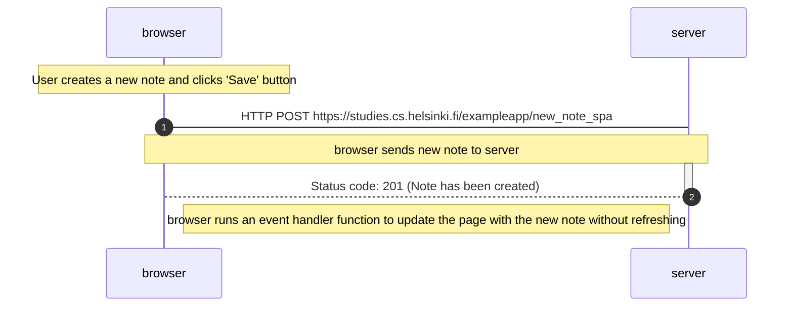

# SPA - New note process

```mermaid
    sequenceDiagram
    autonumber
note over browser: User creates a new note and clicks 'Save' button

browser->server: HTTP POST https://studies.cs.helsinki.fi/exampleapp/new_note_spa
note over browser,server: browser sends new note to server
activate server
server-->browser: Status code: 201 (Note has been created)
deactivate server
note right of browser: browser runs an event handler function to update the page with the new note without refreshing
```
